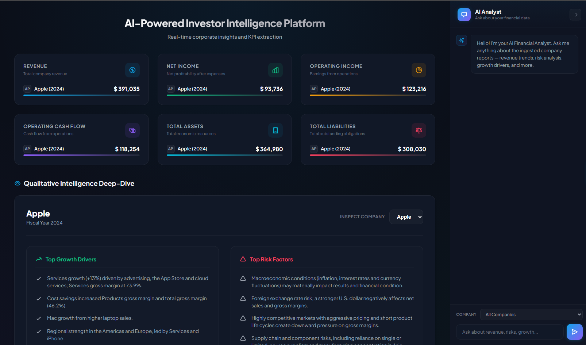

# AI-Powered Investor Intelligence Platform



An AI-powered platform that ingests corporate annual reports (10-Ks), extracts structured financial KPIs with verifiable citations, and answers investor questions through a RAG-based chatbot — all backed by Azure OpenAI, Azure AI Search, and PostgreSQL.

Live at: **https://investor-ai-platform.site**

---

## Technology Stack

### Backend
* FastAPI (async-native on the chat request path), Python 3.12, Uvicorn
* SQLAlchemy + psycopg2 (Azure Database for PostgreSQL — Flexible Server)

### AI / RAG
* **Azure OpenAI** — chat completions (structured outputs via the OpenAI SDK), `text-embedding-3-small` embeddings
* **Azure AI Search** — hybrid vector + keyword + semantic search index
* Retrieval pipeline: multi-query expansion → HyDE (KPI extraction path) → hybrid retrieval → cross-encoder reranking (`sentence-transformers`) → auto-merge to parent pages → LLM context compression
* **RAGAS** — both an offline golden-dataset evaluation harness and async, non-blocking live-chat quality scoring (faithfulness, answer relevancy)

### Auth
* **Microsoft Entra ID** — JWT validation (JWKS) gating the API, **MSAL.js** for browser sign-in on the dashboard, role-based access (`Analyst.Read`, `Ingestion.Write`)

### Storage
* **Azure Blob Storage** — durable persistence for uploaded source PDFs (local disk is ephemeral in AKS)

### Frontend
* Server-rendered dashboard (Jinja2 + vanilla JS), real-time ingestion progress and chat

### Infrastructure & Deployment
* Docker (multi-architecture build — see Deployment below), Azure Kubernetes Service (AKS), Azure Container Registry (ACR)
* `ingress-nginx` + `cert-manager` (Let's Encrypt) for TLS, Azure DNS
* GitHub Actions CI/CD

---

## How It Works, End to End

**1. Upload** — A signed-in user drags a PDF onto the dashboard, which uploads it to `/api/upload` (Entra-authenticated) and persists it to Azure Blob Storage, then hands off to a background ingestion job and returns immediately.

**2. Ingestion pipeline** (real-time progress shown in the UI):
   1. **Convert** — PDF → Markdown (`pymupdf4llm`)
   2. **Chunk & embed** — semantic chunking, embedded via Azure OpenAI
   3. **Index** — uploaded to Azure AI Search (idempotent: content-hash based, skips unchanged chunks, supersedes older filings for the same company/year)
   4. **Extract KPIs** — the retrieval pipeline pulls relevant context, and an LLM extracts revenue, net income, risk factors, growth drivers, etc. as structured data, each field citation-linked back to its exact source chunk/page (hallucinated citations are dropped, not trusted)
   5. **Save** — results written to PostgreSQL

**3. Chat** — A question comes in, the async retrieval pipeline runs (query expansion + hybrid search + reranking + compression, all parallelized), the LLM answers grounded in the retrieved context, and the response is returned. Afterward, a background task scores the answer's faithfulness/relevancy via RAGAS — logged for observability, never blocking the response.

**4. Dashboard** — Displays the latest KPIs per company/year, pulled straight from PostgreSQL.

---

## Local Setup

### 1. Install UV

**Windows**
```bash
powershell -ExecutionPolicy ByPass -c "irm https://astral.sh/uv/install.ps1 | iex"
```

**macOS/Linux**
```bash
curl -LsSf https://astral.sh/uv/install.sh | sh
```

### 2. Create and activate a virtual environment

```bash
uv venv
source .venv/bin/activate   # Windows: .venv\Scripts\activate
```

### 3. Install dependencies

```bash
uv pip install -r requirements.txt
```

### 4. Configure environment variables

Create a `.env` file with the required Azure OpenAI / AI Search / Postgres / Entra / Blob Storage variables (see `.env.example`).

### 5. Run

```bash
python main.py
```

---

## Deployment

Push to `main` triggers `.github/workflows/deploy.yaml`, which builds and deploys the app to AKS end to end:

1. **Azure login** (service principal via `AZURE_CREDENTIALS`)
2. **ACR login** (admin credentials)
3. **Build & push the image** — `docker buildx build --platform linux/arm64 ... --push`. This project's AKS node pool runs **arm64** (Azure Ampere nodes), while GitHub's runners are amd64 — QEMU + Buildx cross-build for the correct target architecture; a plain `docker build` here would silently produce an incompatible image
4. **Get AKS credentials**, then create/update the `invint-secrets` Kubernetes Secret from GitHub Actions secrets
5. **Apply manifests** — `k8s/deployment.yaml`, `k8s/service.yaml` (`ClusterIP` — `ingress-nginx` is the cluster's single public entry point, not a per-service LoadBalancer), `k8s/cluster-issuer.yaml` (Let's Encrypt via `cert-manager`), `k8s/ingress.yaml` (TLS + routing for the custom domain)
6. **Restart and verify the rollout**

Required GitHub Actions secrets: `AZURE_CREDENTIALS`, `ACR_NAME`, `ACR_LOGIN_SERVER`, `ACR_USERNAME`, `ACR_PASSWORD`, `AKS_RESOURCE_GROUP`, `AKS_CLUSTER_NAME`, plus the application's Azure OpenAI / AI Search / Postgres / Entra / Blob Storage variables — one `--from-literal` per app secret in the workflow's *Create Kubernetes Secrets* step.

### Manual deploy (fallback)

```bash
az acr login --name <acr-name>
docker buildx build --platform linux/arm64 -t <acr-login-server>/invint:latest --push .

az aks get-credentials --resource-group <resource-group> --name <cluster-name>

kubectl apply -f k8s/deployment.yaml -f k8s/service.yaml -f k8s/cluster-issuer.yaml -f k8s/ingress.yaml
kubectl rollout restart deployment/invint
kubectl rollout status deployment/invint
```

---

## Notes

* Store secrets in environment variables / Kubernetes Secrets — never commit `.env` files.
* PostgreSQL access is currently IP-firewall based, not VNet-integrated — see the project's internal notes for the reasoning and a safe hands-on lab for practicing the migration.
